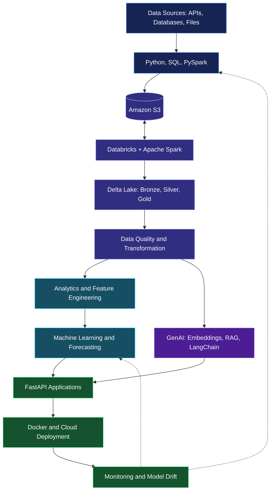

# Raman | Data & AI Engineer

  

  

  
  
  

---

## `01` — About Me

I'm a technology enthusiast focused on building intelligent systems that transform raw data into actionable insights. My interests span **Data Engineering, Machine Learning, Time-Series Analysis, and Generative AI**.

- Building data-driven applications, analytics solutions, and AI-powered systems.
- Exploring scalable data processing with PySpark, Databricks, and Delta Lake.
- Developing ETL/ELT pipelines and cloud data workflows, including Amazon S3.
- Exploring machine learning, time-series forecasting, LLMs, RAG, and AI agents.
- Continuously learning, experimenting, and engineering solutions to real-world problems.

**Education**
- 🎓 M.S. in Data Science — Vellore Institute of Technology, Chennai *(Pursuing)*
- 🎓 B.S. in Computer Science (Hons.) — University of Delhi

📍 Gurugram, India | 📧 [Ram.ansh030@gmail.com](mailto:Ram.ansh030@gmail.com)

---

## `02` — Engineering Domains

<table>
<tr>
<td width="50%" valign="top">

### ⚙️ Data Engineering

- ETL/ELT pipelines and data ingestion
- PySpark and distributed processing
- Databricks and Delta Lake
- Amazon S3 and cloud data storage
- Data modeling, SQL, and validation
- Data quality and pipeline reliability

</td>
<td width="50%" valign="top">

### 🧠 AI & Machine Learning

- Supervised and unsupervised learning
- Feature engineering and model evaluation
- Time-series analysis and forecasting
- Deep learning fundamentals
- Generative AI and LLM applications
- RAG and AI agent architectures

</td>
</tr>
<tr>
<td width="50%" valign="top">

### 🐍 Software & Backend Engineering

- Python application development
- REST API development
- FastAPI and Flask
- LangChain-based LLM workflows
- Backend and database integrations
- Modular and maintainable code

</td>
<td width="50%" valign="top">

### ☁️ Cloud & MLOps

- Cloud platforms and services
- Amazon S3 object storage
- Docker and containerization
- Git-based development workflows
- ML experiment tracking
- Deployment, testing, and monitoring

</td>
</tr>
</table>

---

## `03` — Technology Stack

### Languages & Data Processing

  
  

  
  
  
  
  

### Data Engineering & Lakehouse

  
  
  
  
  

### Machine Learning, Forecasting & AI

  
  
  
  
  

  
  
  
  

### Databases & Storage

  
  
  

### Backend & Application Development

  

### Cloud, DevOps & Developer Tools

  

  
  
  

### Analytics & Visualization

  
  
  
  

---

## `04` — End-to-End Data & AI/ML Engineering Workflow

The workflow below connects data ingestion, lakehouse engineering, analytics, machine learning, and GenAI into one production lifecycle. The technology badges beneath the diagram show the core tools used across these stages.

  

  
  
  
  
  
  
  

I focus on reliable data contracts, validated transformations, reproducible experiments, meaningful model evaluation, secure APIs, and observable production systems. The aim is to make the full lifecycle traceable—from source data to deployed analytics and AI capabilities.

## `05` — GitHub Analytics

  
  

  

---

## `06` — Beyond the Code

I enjoy exploring emerging technologies, experimenting with new ideas, and understanding how software, data, and intelligence can work together to solve practical problems.

  

  <b>Build with data. Engineer with purpose. Scale with intelligence.</b>

  <a href="https://github.com/RAMAN0330">Explore my repositories</a> ·
  <a href="https://www.linkedin.com/in/ramansh0330/">Connect on LinkedIn</a> ·
  <a href="mailto:Ram.ansh030@gmail.com">Let's connect</a>

  

